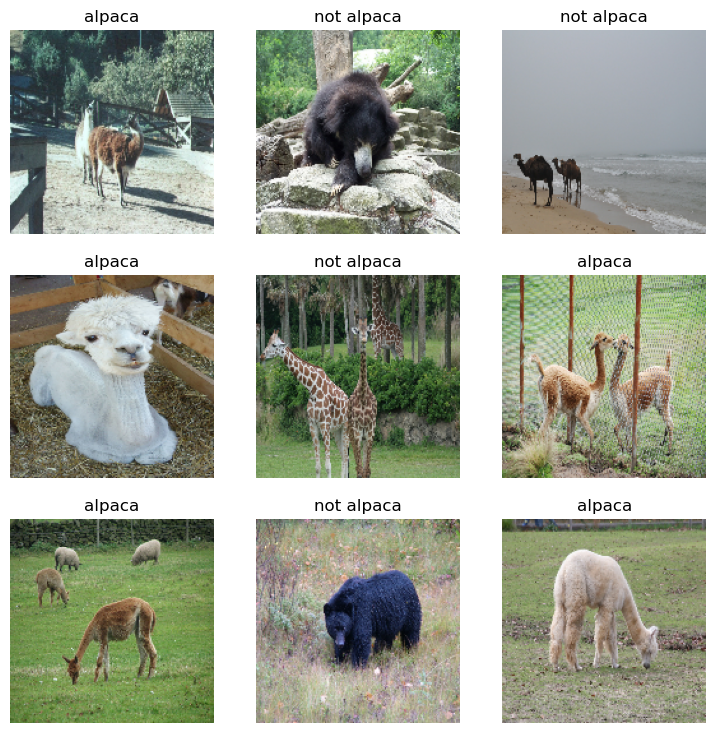
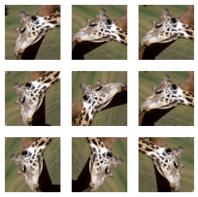
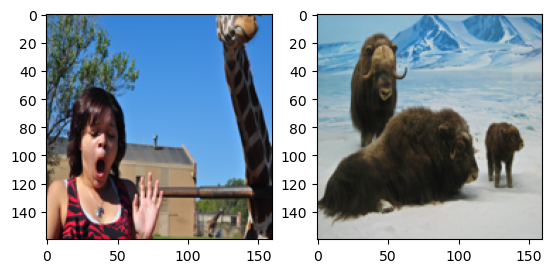
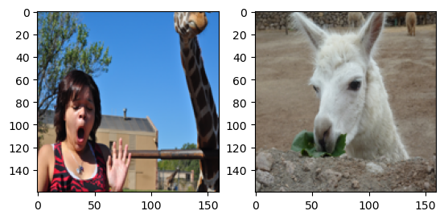

# Image Classification Using Transfer Learning 

image classification of alpacas and not alpacas based on pre-training CNN. 

## 1. Import the required packets


```python
import matplotlib.pyplot as plt
import numpy as np
import os
import tensorflow as tf
import tensorflow.keras.layers as tfl

from tensorflow.keras.preprocessing import image_dataset_from_directory
from tensorflow.keras.layers.experimental.preprocessing import RandomFlip, RandomRotation
```

## 2. Load and split the dataset 

the dataset should be divided into training and test sets (train, validation). The dataset for this research consists of two files: "not alpacas," which includes photographs of other animals, and "alpacas," which contains images of alpacas (i.e., not alpacas). The Kerase method **(image dataset from directory)** allows the dataset to be quickly loaded and stored into training and testing sets.


**validation_split=0.2** split the dataset to be 80% for training and 20% for testing 


```python
BATCH_SIZE = 32
IMG_SIZE = (160, 160)
directory = "dataset/"
train_dataset = image_dataset_from_directory(directory,
                                             shuffle=True,
                                             batch_size=BATCH_SIZE,
                                             image_size=IMG_SIZE,
                                             validation_split=0.2,
                                             subset='training',
                                             seed=42)
test_dataset = image_dataset_from_directory(directory,
                                             shuffle=True,
                                             batch_size=BATCH_SIZE,
                                             image_size=IMG_SIZE,
                                             validation_split=0.2,
                                             subset='validation',
                                             seed=42)
```

    Found 327 files belonging to 2 classes.
    Using 262 files for training.
    Found 327 files belonging to 2 classes.
    Using 65 files for validation.
    

Displaying some images from the dataset to see how the animals are doing these days


```python
class_names = train_dataset.class_names

# take(1) take one batch from training set

plt.figure(figsize=(9, 9))

for images, labels in train_dataset.take(2):
    for i in range(9):
        ax = plt.subplot(3, 3, i + 1)
        plt.imshow(images[i].numpy().astype("uint8"))
        plt.title(class_names[labels[i]])
        plt.axis("off")
```


    

    


### Prefetching

TensorFlow performs this process, making use of all the memory space at its disposal by retrieving data from the disk and processing additional data if it can and if there is space in the memory. to instruct the system to skip awaiting additional data once it has finished processing. This takes less time and can increase system performance.


```python
AUTOTUNE = tf.data.experimental.AUTOTUNE
train_dataset = train_dataset.prefetch(buffer_size=AUTOTUNE)
```

### Agumention
The agumention is a technique used to expand the sample size when there are insufficient samples in the dataset. This may assist with the overfitting issue.

Implement a function for data augmentation. Use a `Sequential` keras model composed of 2 layers:
* `RandomFlip('horizontal')`
* `RandomRotation(0.2)`


```python
def data_augmenter():
    '''
    Create a Sequential model composed of 2 layers
    Returns:
        tf.keras.Sequential
    '''
    ### START CODE HERE
    data_augmentation = tf.keras.Sequential()
    data_augmentation.add(RandomFlip("horizontal"))
    data_augmentation.add(RandomRotation(0.2))
    ### END CODE HERE
    
    return data_augmentation
```

Take a look at how an image from the training set has been augmented with simple transformations:
From one cute animal, to 9 variations of that cute animal, in three lines of code. Now your model has a lot more to learn from.


```python
# Disapear the ERROR
import logging
logging.getLogger('tensorflow').setLevel(logging.ERROR)

data_augmentation = data_augmenter()

for image, _ in train_dataset.take(1):
    plt.figure(figsize=(5, 5))
    first_image = image[0]
    for i in range(9):
        ax = plt.subplot(3, 3, i + 1)
        augmented_image = data_augmentation(tf.expand_dims(first_image, 0))
        plt.imshow(augmented_image[0] / 255)
        plt.axis('off')
```


    

    


# 3.  Using MobileNetV2 for Transfer Learning

MobileNetV2 is a convolutional neural network designed for classification. It is trained using ImageNet, which is a very large dataset containing 14 million images related to a wide range of categories such as people, animals, objects, etc. Because it can detect the animal type, it can be used to recognize alpacas.


```python
IMG_SHAPE = IMG_SIZE + (3,)
base_model = tf.keras.applications.MobileNetV2(input_shape=IMG_SHAPE,
                                               include_top=True,
                                               weights='imagenet')
```


```python
base_model.summary()
```

    Model: "mobilenetv2_1.00_160"
    __________________________________________________________________________________________________
     Layer (type)                   Output Shape         Param #     Connected to                     
    ==================================================================================================
     input_7 (InputLayer)           [(None, 160, 160, 3  0           []                               
                                    )]                                                                
                                                                                                      
     Conv1 (Conv2D)                 (None, 80, 80, 32)   864         ['input_7[0][0]']                
                                                                                                      
     bn_Conv1 (BatchNormalization)  (None, 80, 80, 32)   128         ['Conv1[0][0]']                  
                                                                                                      
     Conv1_relu (ReLU)              (None, 80, 80, 32)   0           ['bn_Conv1[0][0]']               
                                                                                                      
     expanded_conv_depthwise (Depth  (None, 80, 80, 32)  288         ['Conv1_relu[0][0]']             
     wiseConv2D)                                                                                      
                                                                                                      
     expanded_conv_depthwise_BN (Ba  (None, 80, 80, 32)  128         ['expanded_conv_depthwise[0][0]']
     tchNormalization)                                                                                
                                                                                                      
     expanded_conv_depthwise_relu (  (None, 80, 80, 32)  0           ['expanded_conv_depthwise_BN[0][0
     ReLU)                                                           ]']                              
                                                                                                      
     expanded_conv_project (Conv2D)  (None, 80, 80, 16)  512         ['expanded_conv_depthwise_relu[0]
                                                                     [0]']                            
                                                                                                      
     expanded_conv_project_BN (Batc  (None, 80, 80, 16)  64          ['expanded_conv_project[0][0]']  
     hNormalization)                                                                                  
                                                                                                      
     block_1_expand (Conv2D)        (None, 80, 80, 96)   1536        ['expanded_conv_project_BN[0][0]'
                                                                     ]                                
                                                                                                      
     block_1_expand_BN (BatchNormal  (None, 80, 80, 96)  384         ['block_1_expand[0][0]']         
     ization)                                                                                         
                                                                                                      
     block_1_expand_relu (ReLU)     (None, 80, 80, 96)   0           ['block_1_expand_BN[0][0]']      
                                                                                                      
     block_1_pad (ZeroPadding2D)    (None, 81, 81, 96)   0           ['block_1_expand_relu[0][0]']    
                                                                                                      
     block_1_depthwise (DepthwiseCo  (None, 40, 40, 96)  864         ['block_1_pad[0][0]']            
     nv2D)                                                                                            
                                                                                                      
     block_1_depthwise_BN (BatchNor  (None, 40, 40, 96)  384         ['block_1_depthwise[0][0]']      
     malization)                                                                                      
                                                                                                      
     block_1_depthwise_relu (ReLU)  (None, 40, 40, 96)   0           ['block_1_depthwise_BN[0][0]']   
                                                                                                      
     block_1_project (Conv2D)       (None, 40, 40, 24)   2304        ['block_1_depthwise_relu[0][0]'] 
                                                                                                      
     block_1_project_BN (BatchNorma  (None, 40, 40, 24)  96          ['block_1_project[0][0]']        
     lization)                                                                                        
                                                                                                      
     block_2_expand (Conv2D)        (None, 40, 40, 144)  3456        ['block_1_project_BN[0][0]']     
                                                                                                      
     block_2_expand_BN (BatchNormal  (None, 40, 40, 144)  576        ['block_2_expand[0][0]']         
     ization)                                                                                         
                                                                                                      
     block_2_expand_relu (ReLU)     (None, 40, 40, 144)  0           ['block_2_expand_BN[0][0]']      
                                                                                                      
     block_2_depthwise (DepthwiseCo  (None, 40, 40, 144)  1296       ['block_2_expand_relu[0][0]']    
     nv2D)                                                                                            
                                                                                                      
     block_2_depthwise_BN (BatchNor  (None, 40, 40, 144)  576        ['block_2_depthwise[0][0]']      
     malization)                                                                                      
                                                                                                      
     block_2_depthwise_relu (ReLU)  (None, 40, 40, 144)  0           ['block_2_depthwise_BN[0][0]']   
                                                                                                      
     block_2_project (Conv2D)       (None, 40, 40, 24)   3456        ['block_2_depthwise_relu[0][0]'] 
                                                                                                      
     block_2_project_BN (BatchNorma  (None, 40, 40, 24)  96          ['block_2_project[0][0]']        
     lization)                                                                                        
                                                                                                      
     block_2_add (Add)              (None, 40, 40, 24)   0           ['block_1_project_BN[0][0]',     
                                                                      'block_2_project_BN[0][0]']     
                                                                                                      
     block_3_expand (Conv2D)        (None, 40, 40, 144)  3456        ['block_2_add[0][0]']            
                                                                                                      
     block_3_expand_BN (BatchNormal  (None, 40, 40, 144)  576        ['block_3_expand[0][0]']         
     ization)                                                                                         
                                                                                                      
     block_3_expand_relu (ReLU)     (None, 40, 40, 144)  0           ['block_3_expand_BN[0][0]']      
                                                                                                      
     block_3_pad (ZeroPadding2D)    (None, 41, 41, 144)  0           ['block_3_expand_relu[0][0]']    
                                                                                                      
     block_3_depthwise (DepthwiseCo  (None, 20, 20, 144)  1296       ['block_3_pad[0][0]']            
     nv2D)                                                                                            
                                                                                                      
     block_3_depthwise_BN (BatchNor  (None, 20, 20, 144)  576        ['block_3_depthwise[0][0]']      
     malization)                                                                                      
                                                                                                      
     block_3_depthwise_relu (ReLU)  (None, 20, 20, 144)  0           ['block_3_depthwise_BN[0][0]']   
                                                                                                      
     block_3_project (Conv2D)       (None, 20, 20, 32)   4608        ['block_3_depthwise_relu[0][0]'] 
                                                                                                      
     block_3_project_BN (BatchNorma  (None, 20, 20, 32)  128         ['block_3_project[0][0]']        
     lization)                                                                                        
                                                                                                      
     block_4_expand (Conv2D)        (None, 20, 20, 192)  6144        ['block_3_project_BN[0][0]']     
                                                                                                      
     block_4_expand_BN (BatchNormal  (None, 20, 20, 192)  768        ['block_4_expand[0][0]']         
     ization)                                                                                         
                                                                                                      
     block_4_expand_relu (ReLU)     (None, 20, 20, 192)  0           ['block_4_expand_BN[0][0]']      
                                                                                                      
     block_4_depthwise (DepthwiseCo  (None, 20, 20, 192)  1728       ['block_4_expand_relu[0][0]']    
     nv2D)                                                                                            
                                                                                                      
     block_4_depthwise_BN (BatchNor  (None, 20, 20, 192)  768        ['block_4_depthwise[0][0]']      
     malization)                                                                                      
                                                                                                      
     block_4_depthwise_relu (ReLU)  (None, 20, 20, 192)  0           ['block_4_depthwise_BN[0][0]']   
                                                                                                      
     block_4_project (Conv2D)       (None, 20, 20, 32)   6144        ['block_4_depthwise_relu[0][0]'] 
                                                                                                      
     block_4_project_BN (BatchNorma  (None, 20, 20, 32)  128         ['block_4_project[0][0]']        
     lization)                                                                                        
                                                                                                      
     block_4_add (Add)              (None, 20, 20, 32)   0           ['block_3_project_BN[0][0]',     
                                                                      'block_4_project_BN[0][0]']     
                                                                                                      
     block_5_expand (Conv2D)        (None, 20, 20, 192)  6144        ['block_4_add[0][0]']            
                                                                                                      
     block_5_expand_BN (BatchNormal  (None, 20, 20, 192)  768        ['block_5_expand[0][0]']         
     ization)                                                                                         
                                                                                                      
     block_5_expand_relu (ReLU)     (None, 20, 20, 192)  0           ['block_5_expand_BN[0][0]']      
                                                                                                      
     block_5_depthwise (DepthwiseCo  (None, 20, 20, 192)  1728       ['block_5_expand_relu[0][0]']    
     nv2D)                                                                                            
                                                                                                      
     block_5_depthwise_BN (BatchNor  (None, 20, 20, 192)  768        ['block_5_depthwise[0][0]']      
     malization)                                                                                      
                                                                                                      
     block_5_depthwise_relu (ReLU)  (None, 20, 20, 192)  0           ['block_5_depthwise_BN[0][0]']   
                                                                                                      
     block_5_project (Conv2D)       (None, 20, 20, 32)   6144        ['block_5_depthwise_relu[0][0]'] 
                                                                                                      
     block_5_project_BN (BatchNorma  (None, 20, 20, 32)  128         ['block_5_project[0][0]']        
     lization)                                                                                        
                                                                                                      
     block_5_add (Add)              (None, 20, 20, 32)   0           ['block_4_add[0][0]',            
                                                                      'block_5_project_BN[0][0]']     
                                                                                                      
     block_6_expand (Conv2D)        (None, 20, 20, 192)  6144        ['block_5_add[0][0]']            
                                                                                                      
     block_6_expand_BN (BatchNormal  (None, 20, 20, 192)  768        ['block_6_expand[0][0]']         
     ization)                                                                                         
                                                                                                      
     block_6_expand_relu (ReLU)     (None, 20, 20, 192)  0           ['block_6_expand_BN[0][0]']      
                                                                                                      
     block_6_pad (ZeroPadding2D)    (None, 21, 21, 192)  0           ['block_6_expand_relu[0][0]']    
                                                                                                      
     block_6_depthwise (DepthwiseCo  (None, 10, 10, 192)  1728       ['block_6_pad[0][0]']            
     nv2D)                                                                                            
                                                                                                      
     block_6_depthwise_BN (BatchNor  (None, 10, 10, 192)  768        ['block_6_depthwise[0][0]']      
     malization)                                                                                      
                                                                                                      
     block_6_depthwise_relu (ReLU)  (None, 10, 10, 192)  0           ['block_6_depthwise_BN[0][0]']   
                                                                                                      
     block_6_project (Conv2D)       (None, 10, 10, 64)   12288       ['block_6_depthwise_relu[0][0]'] 
                                                                                                      
     block_6_project_BN (BatchNorma  (None, 10, 10, 64)  256         ['block_6_project[0][0]']        
     lization)                                                                                        
                                                                                                      
     block_7_expand (Conv2D)        (None, 10, 10, 384)  24576       ['block_6_project_BN[0][0]']     
                                                                                                      
     block_7_expand_BN (BatchNormal  (None, 10, 10, 384)  1536       ['block_7_expand[0][0]']         
     ization)                                                                                         
                                                                                                      
     block_7_expand_relu (ReLU)     (None, 10, 10, 384)  0           ['block_7_expand_BN[0][0]']      
                                                                                                      
     block_7_depthwise (DepthwiseCo  (None, 10, 10, 384)  3456       ['block_7_expand_relu[0][0]']    
     nv2D)                                                                                            
                                                                                                      
     block_7_depthwise_BN (BatchNor  (None, 10, 10, 384)  1536       ['block_7_depthwise[0][0]']      
     malization)                                                                                      
                                                                                                      
     block_7_depthwise_relu (ReLU)  (None, 10, 10, 384)  0           ['block_7_depthwise_BN[0][0]']   
                                                                                                      
     block_7_project (Conv2D)       (None, 10, 10, 64)   24576       ['block_7_depthwise_relu[0][0]'] 
                                                                                                      
     block_7_project_BN (BatchNorma  (None, 10, 10, 64)  256         ['block_7_project[0][0]']        
     lization)                                                                                        
                                                                                                      
     block_7_add (Add)              (None, 10, 10, 64)   0           ['block_6_project_BN[0][0]',     
                                                                      'block_7_project_BN[0][0]']     
                                                                                                      
     block_8_expand (Conv2D)        (None, 10, 10, 384)  24576       ['block_7_add[0][0]']            
                                                                                                      
     block_8_expand_BN (BatchNormal  (None, 10, 10, 384)  1536       ['block_8_expand[0][0]']         
     ization)                                                                                         
                                                                                                      
     block_8_expand_relu (ReLU)     (None, 10, 10, 384)  0           ['block_8_expand_BN[0][0]']      
                                                                                                      
     block_8_depthwise (DepthwiseCo  (None, 10, 10, 384)  3456       ['block_8_expand_relu[0][0]']    
     nv2D)                                                                                            
                                                                                                      
     block_8_depthwise_BN (BatchNor  (None, 10, 10, 384)  1536       ['block_8_depthwise[0][0]']      
     malization)                                                                                      
                                                                                                      
     block_8_depthwise_relu (ReLU)  (None, 10, 10, 384)  0           ['block_8_depthwise_BN[0][0]']   
                                                                                                      
     block_8_project (Conv2D)       (None, 10, 10, 64)   24576       ['block_8_depthwise_relu[0][0]'] 
                                                                                                      
     block_8_project_BN (BatchNorma  (None, 10, 10, 64)  256         ['block_8_project[0][0]']        
     lization)                                                                                        
                                                                                                      
     block_8_add (Add)              (None, 10, 10, 64)   0           ['block_7_add[0][0]',            
                                                                      'block_8_project_BN[0][0]']     
                                                                                                      
     block_9_expand (Conv2D)        (None, 10, 10, 384)  24576       ['block_8_add[0][0]']            
                                                                                                      
     block_9_expand_BN (BatchNormal  (None, 10, 10, 384)  1536       ['block_9_expand[0][0]']         
     ization)                                                                                         
                                                                                                      
     block_9_expand_relu (ReLU)     (None, 10, 10, 384)  0           ['block_9_expand_BN[0][0]']      
                                                                                                      
     block_9_depthwise (DepthwiseCo  (None, 10, 10, 384)  3456       ['block_9_expand_relu[0][0]']    
     nv2D)                                                                                            
                                                                                                      
     block_9_depthwise_BN (BatchNor  (None, 10, 10, 384)  1536       ['block_9_depthwise[0][0]']      
     malization)                                                                                      
                                                                                                      
     block_9_depthwise_relu (ReLU)  (None, 10, 10, 384)  0           ['block_9_depthwise_BN[0][0]']   
                                                                                                      
     block_9_project (Conv2D)       (None, 10, 10, 64)   24576       ['block_9_depthwise_relu[0][0]'] 
                                                                                                      
     block_9_project_BN (BatchNorma  (None, 10, 10, 64)  256         ['block_9_project[0][0]']        
     lization)                                                                                        
                                                                                                      
     block_9_add (Add)              (None, 10, 10, 64)   0           ['block_8_add[0][0]',            
                                                                      'block_9_project_BN[0][0]']     
                                                                                                      
     block_10_expand (Conv2D)       (None, 10, 10, 384)  24576       ['block_9_add[0][0]']            
                                                                                                      
     block_10_expand_BN (BatchNorma  (None, 10, 10, 384)  1536       ['block_10_expand[0][0]']        
     lization)                                                                                        
                                                                                                      
     block_10_expand_relu (ReLU)    (None, 10, 10, 384)  0           ['block_10_expand_BN[0][0]']     
                                                                                                      
     block_10_depthwise (DepthwiseC  (None, 10, 10, 384)  3456       ['block_10_expand_relu[0][0]']   
     onv2D)                                                                                           
                                                                                                      
     block_10_depthwise_BN (BatchNo  (None, 10, 10, 384)  1536       ['block_10_depthwise[0][0]']     
     rmalization)                                                                                     
                                                                                                      
     block_10_depthwise_relu (ReLU)  (None, 10, 10, 384)  0          ['block_10_depthwise_BN[0][0]']  
                                                                                                      
     block_10_project (Conv2D)      (None, 10, 10, 96)   36864       ['block_10_depthwise_relu[0][0]']
                                                                                                      
     block_10_project_BN (BatchNorm  (None, 10, 10, 96)  384         ['block_10_project[0][0]']       
     alization)                                                                                       
                                                                                                      
     block_11_expand (Conv2D)       (None, 10, 10, 576)  55296       ['block_10_project_BN[0][0]']    
                                                                                                      
     block_11_expand_BN (BatchNorma  (None, 10, 10, 576)  2304       ['block_11_expand[0][0]']        
     lization)                                                                                        
                                                                                                      
     block_11_expand_relu (ReLU)    (None, 10, 10, 576)  0           ['block_11_expand_BN[0][0]']     
                                                                                                      
     block_11_depthwise (DepthwiseC  (None, 10, 10, 576)  5184       ['block_11_expand_relu[0][0]']   
     onv2D)                                                                                           
                                                                                                      
     block_11_depthwise_BN (BatchNo  (None, 10, 10, 576)  2304       ['block_11_depthwise[0][0]']     
     rmalization)                                                                                     
                                                                                                      
     block_11_depthwise_relu (ReLU)  (None, 10, 10, 576)  0          ['block_11_depthwise_BN[0][0]']  
                                                                                                      
     block_11_project (Conv2D)      (None, 10, 10, 96)   55296       ['block_11_depthwise_relu[0][0]']
                                                                                                      
     block_11_project_BN (BatchNorm  (None, 10, 10, 96)  384         ['block_11_project[0][0]']       
     alization)                                                                                       
                                                                                                      
     block_11_add (Add)             (None, 10, 10, 96)   0           ['block_10_project_BN[0][0]',    
                                                                      'block_11_project_BN[0][0]']    
                                                                                                      
     block_12_expand (Conv2D)       (None, 10, 10, 576)  55296       ['block_11_add[0][0]']           
                                                                                                      
     block_12_expand_BN (BatchNorma  (None, 10, 10, 576)  2304       ['block_12_expand[0][0]']        
     lization)                                                                                        
                                                                                                      
     block_12_expand_relu (ReLU)    (None, 10, 10, 576)  0           ['block_12_expand_BN[0][0]']     
                                                                                                      
     block_12_depthwise (DepthwiseC  (None, 10, 10, 576)  5184       ['block_12_expand_relu[0][0]']   
     onv2D)                                                                                           
                                                                                                      
     block_12_depthwise_BN (BatchNo  (None, 10, 10, 576)  2304       ['block_12_depthwise[0][0]']     
     rmalization)                                                                                     
                                                                                                      
     block_12_depthwise_relu (ReLU)  (None, 10, 10, 576)  0          ['block_12_depthwise_BN[0][0]']  
                                                                                                      
     block_12_project (Conv2D)      (None, 10, 10, 96)   55296       ['block_12_depthwise_relu[0][0]']
                                                                                                      
     block_12_project_BN (BatchNorm  (None, 10, 10, 96)  384         ['block_12_project[0][0]']       
     alization)                                                                                       
                                                                                                      
     block_12_add (Add)             (None, 10, 10, 96)   0           ['block_11_add[0][0]',           
                                                                      'block_12_project_BN[0][0]']    
                                                                                                      
     block_13_expand (Conv2D)       (None, 10, 10, 576)  55296       ['block_12_add[0][0]']           
                                                                                                      
     block_13_expand_BN (BatchNorma  (None, 10, 10, 576)  2304       ['block_13_expand[0][0]']        
     lization)                                                                                        
                                                                                                      
     block_13_expand_relu (ReLU)    (None, 10, 10, 576)  0           ['block_13_expand_BN[0][0]']     
                                                                                                      
     block_13_pad (ZeroPadding2D)   (None, 11, 11, 576)  0           ['block_13_expand_relu[0][0]']   
                                                                                                      
     block_13_depthwise (DepthwiseC  (None, 5, 5, 576)   5184        ['block_13_pad[0][0]']           
     onv2D)                                                                                           
                                                                                                      
     block_13_depthwise_BN (BatchNo  (None, 5, 5, 576)   2304        ['block_13_depthwise[0][0]']     
     rmalization)                                                                                     
                                                                                                      
     block_13_depthwise_relu (ReLU)  (None, 5, 5, 576)   0           ['block_13_depthwise_BN[0][0]']  
                                                                                                      
     block_13_project (Conv2D)      (None, 5, 5, 160)    92160       ['block_13_depthwise_relu[0][0]']
                                                                                                      
     block_13_project_BN (BatchNorm  (None, 5, 5, 160)   640         ['block_13_project[0][0]']       
     alization)                                                                                       
                                                                                                      
     block_14_expand (Conv2D)       (None, 5, 5, 960)    153600      ['block_13_project_BN[0][0]']    
                                                                                                      
     block_14_expand_BN (BatchNorma  (None, 5, 5, 960)   3840        ['block_14_expand[0][0]']        
     lization)                                                                                        
                                                                                                      
     block_14_expand_relu (ReLU)    (None, 5, 5, 960)    0           ['block_14_expand_BN[0][0]']     
                                                                                                      
     block_14_depthwise (DepthwiseC  (None, 5, 5, 960)   8640        ['block_14_expand_relu[0][0]']   
     onv2D)                                                                                           
                                                                                                      
     block_14_depthwise_BN (BatchNo  (None, 5, 5, 960)   3840        ['block_14_depthwise[0][0]']     
     rmalization)                                                                                     
                                                                                                      
     block_14_depthwise_relu (ReLU)  (None, 5, 5, 960)   0           ['block_14_depthwise_BN[0][0]']  
                                                                                                      
     block_14_project (Conv2D)      (None, 5, 5, 160)    153600      ['block_14_depthwise_relu[0][0]']
                                                                                                      
     block_14_project_BN (BatchNorm  (None, 5, 5, 160)   640         ['block_14_project[0][0]']       
     alization)                                                                                       
                                                                                                      
     block_14_add (Add)             (None, 5, 5, 160)    0           ['block_13_project_BN[0][0]',    
                                                                      'block_14_project_BN[0][0]']    
                                                                                                      
     block_15_expand (Conv2D)       (None, 5, 5, 960)    153600      ['block_14_add[0][0]']           
                                                                                                      
     block_15_expand_BN (BatchNorma  (None, 5, 5, 960)   3840        ['block_15_expand[0][0]']        
     lization)                                                                                        
                                                                                                      
     block_15_expand_relu (ReLU)    (None, 5, 5, 960)    0           ['block_15_expand_BN[0][0]']     
                                                                                                      
     block_15_depthwise (DepthwiseC  (None, 5, 5, 960)   8640        ['block_15_expand_relu[0][0]']   
     onv2D)                                                                                           
                                                                                                      
     block_15_depthwise_BN (BatchNo  (None, 5, 5, 960)   3840        ['block_15_depthwise[0][0]']     
     rmalization)                                                                                     
                                                                                                      
     block_15_depthwise_relu (ReLU)  (None, 5, 5, 960)   0           ['block_15_depthwise_BN[0][0]']  
                                                                                                      
     block_15_project (Conv2D)      (None, 5, 5, 160)    153600      ['block_15_depthwise_relu[0][0]']
                                                                                                      
     block_15_project_BN (BatchNorm  (None, 5, 5, 160)   640         ['block_15_project[0][0]']       
     alization)                                                                                       
                                                                                                      
     block_15_add (Add)             (None, 5, 5, 160)    0           ['block_14_add[0][0]',           
                                                                      'block_15_project_BN[0][0]']    
                                                                                                      
     block_16_expand (Conv2D)       (None, 5, 5, 960)    153600      ['block_15_add[0][0]']           
                                                                                                      
     block_16_expand_BN (BatchNorma  (None, 5, 5, 960)   3840        ['block_16_expand[0][0]']        
     lization)                                                                                        
                                                                                                      
     block_16_expand_relu (ReLU)    (None, 5, 5, 960)    0           ['block_16_expand_BN[0][0]']     
                                                                                                      
     block_16_depthwise (DepthwiseC  (None, 5, 5, 960)   8640        ['block_16_expand_relu[0][0]']   
     onv2D)                                                                                           
                                                                                                      
     block_16_depthwise_BN (BatchNo  (None, 5, 5, 960)   3840        ['block_16_depthwise[0][0]']     
     rmalization)                                                                                     
                                                                                                      
     block_16_depthwise_relu (ReLU)  (None, 5, 5, 960)   0           ['block_16_depthwise_BN[0][0]']  
                                                                                                      
     block_16_project (Conv2D)      (None, 5, 5, 320)    307200      ['block_16_depthwise_relu[0][0]']
                                                                                                      
     block_16_project_BN (BatchNorm  (None, 5, 5, 320)   1280        ['block_16_project[0][0]']       
     alization)                                                                                       
                                                                                                      
     Conv_1 (Conv2D)                (None, 5, 5, 1280)   409600      ['block_16_project_BN[0][0]']    
                                                                                                      
     Conv_1_bn (BatchNormalization)  (None, 5, 5, 1280)  5120        ['Conv_1[0][0]']                 
                                                                                                      
     out_relu (ReLU)                (None, 5, 5, 1280)   0           ['Conv_1_bn[0][0]']              
                                                                                                      
     global_average_pooling2d_4 (Gl  (None, 1280)        0           ['out_relu[0][0]']               
     obalAveragePooling2D)                                                                            
                                                                                                      
     predictions (Dense)            (None, 1000)         1281000     ['global_average_pooling2d_4[0][0
                                                                     ]']                              
                                                                                                      
    ==================================================================================================
    Total params: 3,538,984
    Trainable params: 3,504,872
    Non-trainable params: 34,112
    __________________________________________________________________________________________________
    

# 4. Alpaca Model 

Make the input proper for mobilenet v2 by this code.


```python
preprocess_input = tf.keras.applications.mobilenet_v2.preprocess_input
```


```python
def alpaca_model(image_shape=IMG_SIZE, data_augmentation=data_augmenter()):
    ''' Define a tf.keras model for binary classification out of the MobileNetV2 model
    Arguments:
        image_shape -- Image width and height
        data_augmentation -- data augmentation function
    Returns:
    Returns:
        tf.keras.model
    '''
    
    
    input_shape = image_shape + (3,)
    
    ### START CODE HERE
    
    base_model = tf.keras.applications.MobileNetV2(input_shape=input_shape,
                                                   include_top=False, # <== Important!!!!
                                                   weights='imagenet') # From imageNet
    
    # freeze the base model by making it non trainable
    base_model.trainable = False 

    # create the input layer (Same as the imageNetv2 input size)
    inputs = tf.keras.Input(shape=input_shape) 
    
    # apply data augmentation to the inputs
    x = data_augmentation(inputs)
    
    # data preprocessing using the same weights the model was trained on
    x = preprocess_input(x) 
    
    # set training to False to avoid keeping track of statistics in the batch norm layer
    x = base_model(x, training=False) 
    
    # add the new Binary classification layers
    # use global avg pooling to summarize the info in each channel
    x = tfl.GlobalAveragePooling2D()(x) 
    # include dropout with probability of 0.2 to avoid overfitting
    x = tfl.Dropout(0.2)(x)
    prediction_layer = tfl.Dense(1)
        
    # use a prediction layer with one neuron (as a binary classifier only needs one)
    outputs = prediction_layer(x)
    
    ### END CODE HERE
    
    model = tf.keras.Model(inputs, outputs)
    
    return model
```


```python
model2 = alpaca_model(IMG_SIZE, data_augmentation)
```


```python
base_learning_rate = 0.001
model2.compile(optimizer=tf.keras.optimizers.Adam(learning_rate=base_learning_rate),
              loss=tf.keras.losses.BinaryCrossentropy(from_logits=True),
              metrics=['accuracy'])
```


```python
initial_epochs = 10
history = model2.fit(train_dataset, validation_data=test_dataset, epochs=initial_epochs)
```

    Epoch 1/10
    9/9 [==============================] - 11s 679ms/step - loss: 0.8219 - accuracy: 0.4618 - val_loss: 0.5564 - val_accuracy: 0.6769
    Epoch 2/10
    9/9 [==============================] - 6s 599ms/step - loss: 0.6700 - accuracy: 0.5992 - val_loss: 0.4389 - val_accuracy: 0.7231
    Epoch 3/10
    9/9 [==============================] - 6s 581ms/step - loss: 0.5006 - accuracy: 0.7137 - val_loss: 0.3804 - val_accuracy: 0.7077
    Epoch 4/10
    9/9 [==============================] - 6s 624ms/step - loss: 0.4651 - accuracy: 0.7634 - val_loss: 0.3158 - val_accuracy: 0.8000
    Epoch 5/10
    9/9 [==============================] - 7s 665ms/step - loss: 0.4001 - accuracy: 0.7901 - val_loss: 0.3030 - val_accuracy: 0.7692
    Epoch 6/10
    9/9 [==============================] - 6s 621ms/step - loss: 0.4319 - accuracy: 0.7634 - val_loss: 0.2497 - val_accuracy: 0.8615
    Epoch 7/10
    9/9 [==============================] - 6s 624ms/step - loss: 0.3835 - accuracy: 0.8092 - val_loss: 0.2317 - val_accuracy: 0.8769
    Epoch 8/10
    9/9 [==============================] - 6s 610ms/step - loss: 0.3528 - accuracy: 0.8053 - val_loss: 0.2265 - val_accuracy: 0.8615
    Epoch 9/10
    9/9 [==============================] - 7s 711ms/step - loss: 0.3071 - accuracy: 0.8435 - val_loss: 0.2132 - val_accuracy: 0.8769
    Epoch 10/10
    9/9 [==============================] - 7s 641ms/step - loss: 0.3388 - accuracy: 0.8511 - val_loss: 0.2020 - val_accuracy: 0.9077
    

Test images 


```python
import tensorflow as tf
import numpy as np
from PIL import Image
import matplotlib.pyplot as plt

IMG_SIZE = (160, 160) # set the image size

# Load the images
img1 = Image.open('dataset/not alpaca/0ff3adf2084ca670.jpg').resize(IMG_SIZE)
img2 = Image.open('dataset/not alpaca/1baa67b7a05a87c6.jpg').resize(IMG_SIZE)

# Convert the images to numpy arrays
x1 = np.array(img1)
x2 = np.array(img2)

# Make predictions
preds1 = model2.predict(np.array([x1]))
preds2 = model2.predict(np.array([x2]))

# Print the results
if preds1 > 0:
    print("Not an Alpaca")
else:
    print('Alpaca')
    
if preds2 > 0:
    print("Not an Alpaca")
else:
    print('Alpaca')

# Display the images
fig, ax = plt.subplots(1, 2)
ax[0].imshow(img1)
ax[1].imshow(img2)
plt.show()
```

    1/1 [==============================] - 0s 80ms/step
    1/1 [==============================] - 0s 81ms/step
    Not an Alpaca
    Not an Alpaca
    


    

    


```python
history.history['accuracy']
```


    [0.46183204650878906,
     0.5992366671562195,
     0.7137404680252075,
     0.7633587718009949,
     0.7900763154029846,
     0.7633587718009949,
     0.8091602921485901,
     0.805343508720398,
     0.8435114622116089,
     0.8511450290679932]


```python
history.history['val_accuracy']
```


    [0.6769230961799622,
     0.7230769395828247,
     0.7076923251152039,
     0.800000011920929,
     0.7692307829856873,
     0.8615384697914124,
     0.8769230842590332,
     0.8615384697914124,
     0.8769230842590332,
     0.9076923131942749]


Above the system, it was designed to just remove the last layer and change from softmax to binary, then train the mobilev2 using the dataset. Now, let's train the system using the last few layers.

 ### fine-tuning


```python
base_model = model2.layers[4]
base_model.trainable = True
# Let's take a look to see how many layers are in the base model
print("Number of layers in the base model: ", len(base_model.layers))

# Fine-tune from this layer onwards
fine_tune_at = 120

### START CODE HERE

# Freeze all the layers before the `fine_tune_at` layer
for layer in base_model.layers[:fine_tune_at]:
    layer.trainable = None
    
# Define a BinaryCrossentropy loss function. Use from_logits=True
loss_function=tf.keras.losses.BinaryCrossentropy(from_logits=True)
# Define an Adam optimizer with a learning rate of 0.1 * base_learning_rate
optimizer = tf.keras.optimizers.Adam(learning_rate=base_learning_rate*0.1)# 0.001
# Use accuracy as evaluation metric
metrics=['accuracy']

### END CODE HERE

model2.compile(loss=loss_function,
              optimizer = optimizer,
              metrics=metrics)
```

    Number of layers in the base model:  154
    


```python
fine_tune_epochs = 5
total_epochs =  initial_epochs + fine_tune_epochs

history_fine = model2.fit(train_dataset,
                         epochs=total_epochs,
                         initial_epoch=history.epoch[-1],
                         validation_data=test_dataset)
```

    Epoch 10/15
    9/9 [==============================] - 16s 1s/step - loss: 0.4658 - accuracy: 0.8053 - val_loss: 0.1893 - val_accuracy: 0.9385
    Epoch 11/15
    9/9 [==============================] - 9s 850ms/step - loss: 0.2700 - accuracy: 0.9084 - val_loss: 0.1407 - val_accuracy: 0.9385
    Epoch 12/15
    9/9 [==============================] - 9s 896ms/step - loss: 0.1801 - accuracy: 0.9122 - val_loss: 0.1353 - val_accuracy: 0.9231
    Epoch 13/15
    9/9 [==============================] - 8s 846ms/step - loss: 0.1962 - accuracy: 0.9198 - val_loss: 0.0844 - val_accuracy: 0.9846
    Epoch 14/15
    9/9 [==============================] - 8s 813ms/step - loss: 0.1943 - accuracy: 0.9160 - val_loss: 0.0759 - val_accuracy: 0.9846
    Epoch 15/15
    9/9 [==============================] - 8s 809ms/step - loss: 0.1545 - accuracy: 0.9618 - val_loss: 0.0705 - val_accuracy: 1.0000
    


```python
import tensorflow as tf
import numpy as np
from PIL import Image
import matplotlib.pyplot as plt

IMG_SIZE = (160, 160) # set the image size

# Load the images
img1 = Image.open('dataset/not alpaca/0ff3adf2084ca670.jpg').resize(IMG_SIZE)
img2 = Image.open('dataset/alpaca/0cb5cae66bb9c4cd.jpg').resize(IMG_SIZE)

# Convert the images to numpy arrays
x1 = np.array(img1)
x2 = np.array(img2)

# Make predictions
preds1 = model2.predict(np.array([x1]))
preds2 = model2.predict(np.array([x2]))

# Print the results
if preds1 > 0:
    print("Not an Alpaca")
else:
    print('Alpaca')
    
if preds2 > 0:
    print("Not an Alpaca")
else:
    print('Alpaca')

# Display the images
fig, ax = plt.subplots(1, 2)
ax[0].imshow(img1)
ax[1].imshow(img2)
plt.show()

```

    1/1 [==============================] - 0s 47ms/step
    1/1 [==============================] - 0s 34ms/step
    Not an Alpaca
    Alpaca
    


    

    

